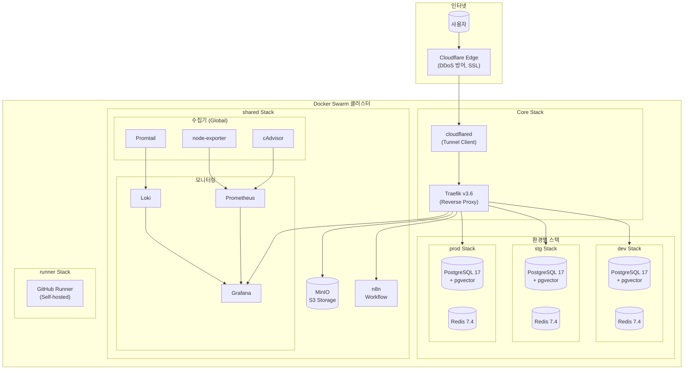
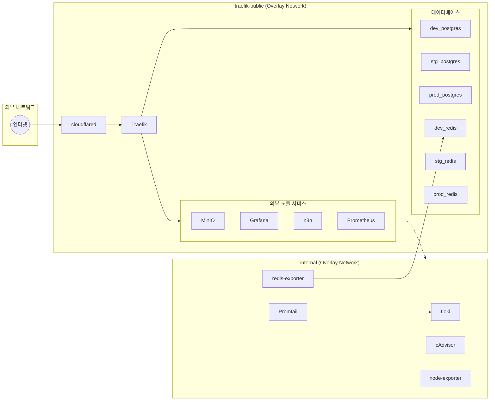
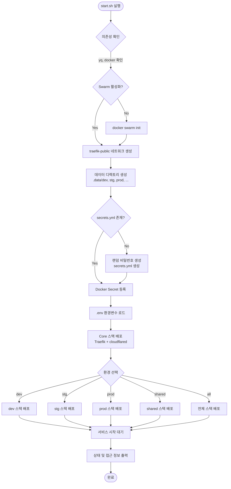
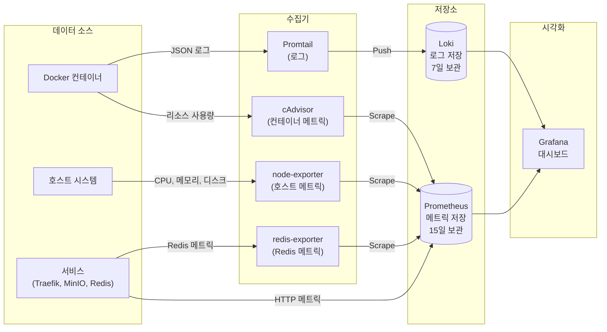
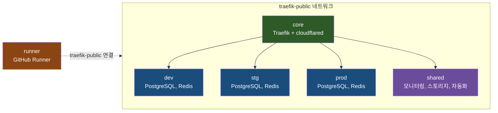

# NextCandle Infrastructure

Docker Swarm 기반 멀티 환경 컨테이너 오케스트레이션 인프라입니다.

> **Zero Trust 네트워킹**: Cloudflare Tunnel을 통한 외부 접근으로 인터넷에 포트를 노출하지 않습니다.

## 목차

- [아키텍처](#아키텍처)
- [전제 조건](#전제-조건)
- [빠른 시작](#빠른-시작)
- [스택 구성](#스택-구성)
- [서비스 상세](#서비스-상세)
- [네트워크 구성](#네트워크-구성)
- [볼륨 및 데이터 저장](#볼륨-및-데이터-저장)
- [Secret 관리](#secret-관리)
- [명령어 레퍼런스](#명령어-레퍼런스)
- [서비스 접근](#서비스-접근)
- [환경 변수](#환경-변수)
- [트러블슈팅](#트러블슈팅)

---

## 아키텍처

### 전체 시스템 아키텍처



### 네트워크 토폴로지



### 배포 플로우



### 모니터링 파이프라인



---

## 전제 조건

| 요구사항 | 버전 | 설명 |
|---------|------|------|
| Docker | 24.x+ | 컨테이너 런타임 |
| Docker Swarm | - | 오케스트레이션 (docker swarm init) |
| yq | 4.x+ | YAML 프로세서 (secrets.yml 파싱) |

### 설치

```bash
# Docker 확인
docker --version

# Docker Swarm 초기화 (아직 안 했다면)
docker swarm init

# yq 설치 (macOS)
brew install yq

# yq 설치 (Linux - AMD64)
wget https://github.com/mikefarah/yq/releases/latest/download/yq_linux_amd64 -O /usr/local/bin/yq
chmod +x /usr/local/bin/yq
```

---

## 빠른 시작

```bash
# 1. 저장소 클론
git clone <repository-url>
cd nextcandle-infra

# 2. 환경 설정
cp .env.example .env

# 3. Cloudflare Tunnel 토큰 설정 (필수)
# https://one.dash.cloudflare.com/ → Access → Tunnels
vim .env  # CLOUDFLARE_TUNNEL_TOKEN 입력

# 4. 인프라 시작
./scripts/start.sh dev      # 개발 환경
./scripts/start.sh all      # 전체 환경

# 5. 상태 확인
./scripts/status.sh
```

첫 실행 시 `secrets/secrets.yml`이 자동 생성되며, 모든 비밀번호가 랜덤으로 설정됩니다.

---

## 스택 구성

| 스택 | 파일 | 서비스 | 용도 |
|------|------|--------|------|
| **core** | `docker-compose.yml` | Traefik, cloudflared | 리버스 프록시, 외부 터널 |
| **dev** | `stacks/dev.yml` | PostgreSQL, Redis | 개발 환경 DB |
| **stg** | `stacks/stg.yml` | PostgreSQL, Redis | 스테이징 환경 DB |
| **prod** | `stacks/prod.yml` | PostgreSQL, Redis | 프로덕션 환경 DB |
| **shared** | `stacks/shared.yml` | MinIO, Grafana, Prometheus, n8n, Loki, Promtail, cAdvisor, node-exporter, redis-exporter | 공유 서비스 |
| **runner** | `stacks/runner.yml` | GitHub Runner | CI/CD (별도 관리) |

### 스택 의존성



> **runner 스택 분리 이유**: `RUNNER_TOKEN`은 1시간만 유효하므로, shared 스택 재배포 시 runner가 영향받지 않도록 독립적으로 관리합니다.

---

## 서비스 상세

### Core Stack

#### Traefik v3.6

| 항목 | 값 |
|------|-----|
| **역할** | 리버스 프록시, 로드밸런서, 서비스 디스커버리 |
| **이미지** | `traefik:v3.6` |
| **포트** | 80 (HTTP), 443 (HTTPS), 8080 (Dashboard) |
| **리소스** | CPU: 0.10-0.50, Memory: 64M-256M |
| **배치** | Manager 노드만 |

주요 기능:
- Docker Swarm 프로바이더로 자동 서비스 디스커버리
- Prometheus 메트릭 내보내기
- JSON 포맷 액세스 로그

#### cloudflared

| 항목 | 값 |
|------|-----|
| **역할** | Cloudflare Tunnel 클라이언트 (Zero Trust) |
| **이미지** | `cloudflare/cloudflared:2024.12.2` |
| **리소스** | CPU: 0.05-0.20, Memory: 64M-128M |

외부에서 내부 서비스로 접근할 때 포트 개방 없이 Cloudflare를 통해 터널링합니다.

---

### Environment Stacks (dev/stg/prod)

#### PostgreSQL 17 + pgvector

| 환경 | 포트 | 리소스 (CPU/Memory) | 설정 파일 |
|------|------|---------------------|-----------|
| dev | 5432 | 0.10-0.50 / 256M-512M | `postgresql.conf` |
| stg | 5433 | 0.10-0.50 / 256M-512M | `postgresql.conf` |
| prod | 5434 | 0.20-1.00 / 512M-1G | `postgresql-prod.conf` |

특징:
- **pgvector 확장**: 벡터 검색 지원
- **SCRAM-SHA-256**: 보안 강화된 비밀번호 암호화
- **Secret 기반 인증**: 환경변수 대신 Docker Secret 사용

Production 최적화:
- 2배 CPU/메모리 할당
- 병렬 쿼리 지원 (쿼리당 2 workers, 총 4 workers)
- 더 큰 shared_buffers (256MB)

#### Redis 7.4

| 환경 | 포트 | Max Memory | 리소스 (CPU/Memory) |
|------|------|------------|---------------------|
| dev | 6379 | 128MB | 0.05-0.20 / 64M-256M |
| stg | (내부 전용) | 128MB | 0.05-0.20 / 64M-256M |
| prod | 6381 | 256MB | 0.10-0.50 / 128M-512M |

설정:
- `maxmemory-policy: noeviction` (메모리 초과 시 쓰기 거부)
- `appendonly: yes` (AOF 영속성)
- prod: `appendfsync everysec` (초당 동기화)

---

### Shared Stack

#### MinIO

| 항목 | 값 |
|------|-----|
| **역할** | S3 호환 오브젝트 스토리지 |
| **이미지** | `minio/minio:RELEASE.2024-12-18T13-15-44Z` |
| **API URL** | `s3.nextcandle.io` (9000) |
| **Console URL** | `minio.nextcandle.io` (9001) |
| **리소스** | CPU: 0.10-0.50, Memory: 128M-512M |

> ⚠️ MinIO Docker Hub 이미지는 2025.10 이후 업데이트 중단 예정

#### Grafana

| 항목 | 값 |
|------|-----|
| **역할** | 모니터링 대시보드 |
| **이미지** | `grafana/grafana:12.3.1` |
| **URL** | `grafana.nextcandle.io` |
| **리소스** | CPU: 0.10-0.50, Memory: 128M-256M |
| **데이터소스** | Prometheus, Loki (자동 프로비저닝) |

#### Prometheus

| 항목 | 값 |
|------|-----|
| **역할** | 메트릭 수집 및 저장 |
| **이미지** | `prom/prometheus:v3.1.0` |
| **URL** | `prometheus.localhost` (로컬만) |
| **보관 기간** | 15일 |
| **Scrape 간격** | 15초 |
| **리소스** | CPU: 0.10-0.50, Memory: 128M-512M |

Scrape 대상:
- Traefik (HTTP 메트릭)
- MinIO (스토리지 메트릭)
- Redis Exporter
- cAdvisor (컨테이너 메트릭)
- node-exporter (호스트 메트릭)

#### n8n

| 항목 | 값 |
|------|-----|
| **역할** | 워크플로우 자동화 |
| **이미지** | `n8nio/n8n:2.1.2` |
| **URL** | `n8n.nextcandle.io` |
| **리소스** | CPU: 0.50-2.0, Memory: 512M-2G |
| **타임존** | Asia/Seoul |

가장 많은 리소스가 할당된 서비스입니다.

#### Loki

| 항목 | 값 |
|------|-----|
| **역할** | 로그 수집 및 저장 |
| **이미지** | `grafana/loki:3.6.3` |
| **보관 기간** | 7일 |
| **스키마** | v13 (TSDB) |
| **리소스** | CPU: 0.05-0.30, Memory: 64M-256M |

#### Promtail

| 항목 | 값 |
|------|-----|
| **역할** | 컨테이너 로그 수집 에이전트 |
| **이미지** | `grafana/promtail:3.6.3` |
| **배포 모드** | Global (모든 노드) |
| **리소스** | CPU: 0.05-0.20, Memory: 32M-128M |

Docker Swarm 서비스 로그를 자동 수집하여 다음 라벨 추가:
- `container`: 컨테이너 이름
- `service`: Swarm 서비스명
- `stack`: 스택 이름
- `image`: 이미지명

#### cAdvisor

| 항목 | 값 |
|------|-----|
| **역할** | 컨테이너 리소스 메트릭 수집 |
| **이미지** | `gcr.io/cadvisor/cadvisor:v0.51.0` |
| **배포 모드** | Global (모든 노드) |
| **리소스** | CPU: 0.05-0.30, Memory: 64M-256M |

수집 메트릭: CPU, Memory, Network I/O, Disk I/O per container

#### node-exporter

| 항목 | 값 |
|------|-----|
| **역할** | 호스트 시스템 메트릭 수집 |
| **이미지** | `prom/node-exporter:v1.8.2` |
| **배포 모드** | Global (모든 노드) |
| **리소스** | CPU: 0.05-0.20, Memory: 32M-128M |

수집 메트릭: CPU, Memory, Disk, Network (호스트 레벨)

#### redis-exporter

| 항목 | 값 |
|------|-----|
| **역할** | Redis 메트릭 내보내기 |
| **이미지** | `oliver006/redis_exporter:v1.66.0-alpine` |
| **대상** | dev_redis:6379 (현재 dev만) |
| **리소스** | CPU: 0.02-0.10, Memory: 32M-64M |

---

### Runner Stack

#### GitHub Actions Self-hosted Runner

| 항목 | 값 |
|------|-----|
| **역할** | GitHub Actions CI/CD 실행 |
| **이미지** | `ghcr.io/m16khb/github-runner:latest` |
| **배치** | Manager 노드만 |
| **리소스** | CPU: 0.5-2.0, Memory: 1G-4G |
| **Replicas** | 환경변수로 설정 (기본 2) |

> ⚠️ **토큰 만료 주의**: RUNNER_TOKEN은 1시간만 유효합니다. shared 스택과 분리된 이유입니다.

---

## 네트워크 구성

### Overlay 네트워크

| 네트워크 | 범위 | 용도 |
|---------|------|------|
| `traefik-public` | 전체 스택 공유 | 외부 트래픽 라우팅 |
| `internal` | 스택 내부 | 백엔드 통신 |

### 포트 매핑

| 포트 | 서비스 | 접근 |
|------|--------|------|
| 80 | Traefik HTTP | Host |
| 443 | Traefik HTTPS | Host |
| 8080 | Traefik Dashboard | Host (로컬) |
| 5432 | PostgreSQL Dev | Host |
| 5433 | PostgreSQL Stg | Host |
| 5434 | PostgreSQL Prod | Host |
| 6379 | Redis Dev | Host |
| 6380 | Redis Stg | Host |
| 6381 | Redis Prod | Host |

---

## 볼륨 및 데이터 저장

### 디렉토리 구조

```
nextcandle-infra/
├── .data/                          # 데이터 저장 (git 제외)
│   ├── dev/
│   │   ├── postgres/               # PostgreSQL 데이터
│   │   └── redis/                  # Redis 데이터
│   ├── stg/
│   │   ├── postgres/
│   │   └── redis/
│   ├── prod/
│   │   ├── postgres/
│   │   └── redis/
│   ├── minio/                      # S3 객체 저장소
│   ├── prometheus/                 # 메트릭 데이터
│   ├── grafana/                    # 대시보드 설정
│   ├── n8n/                        # 워크플로우 데이터
│   ├── loki/                       # 로그 데이터
│   └── promtail/                   # 로그 위치 정보
├── configs/                        # 서비스 설정 (읽기 전용 마운트)
│   ├── traefik/
│   ├── postgres/
│   ├── prometheus/
│   ├── loki/
│   ├── promtail/
│   └── grafana/
├── secrets/                        # 민감 정보 (git 제외)
├── scripts/                        # 관리 스크립트
└── stacks/                         # 환경별 스택 정의
```

### Named Volumes

| 볼륨 | 용도 |
|------|------|
| `traefik-certs` | Let's Encrypt 인증서 |
| `runner-work` | GitHub Runner 빌드 캐시 |

---

## Secret 관리

### 2단계 Secret 시스템

1. **`.env`** - 설정 및 외부 토큰
   - 프로젝트 설정
   - Cloudflare Tunnel 토큰
   - GitHub Runner 토큰 (1시간 만료)
   - Supabase 키

2. **`secrets/secrets.yml`** - 내부 인증 정보
   - 데이터베이스 비밀번호 (자동 생성)
   - 서비스 관리자 계정
   - Docker Secret으로 컨테이너에 주입

### Secret 목록

| Secret | 스택 | 서비스 |
|--------|------|--------|
| `dev_postgres_db/user/password` | dev | PostgreSQL |
| `stg_postgres_db/user/password` | stg | PostgreSQL |
| `prod_postgres_db/user/password` | prod | PostgreSQL |
| `dev_redis_password` | dev | Redis |
| `stg_redis_password` | stg | Redis |
| `prod_redis_password` | prod | Redis |
| `minio_root_user/password` | shared | MinIO |
| `grafana_admin_user/password` | shared | Grafana |
| `n8n_user/password` | shared | n8n |
| `traefik_dashboard_auth` | core | Traefik (htpasswd) |

### Secret 재생성

```bash
# 전체 Secret 재생성 (주의: 데이터 접근 불가)
./scripts/stop.sh all
docker secret rm $(docker secret ls -q)
rm secrets/secrets.yml
./scripts/start.sh all
```

---

## 명령어 레퍼런스

### 시작/중지

```bash
# 시작
./scripts/start.sh              # 전체 (runner 제외, all과 동일)
./scripts/start.sh dev          # Core + dev
./scripts/start.sh stg          # Core + stg
./scripts/start.sh prod         # Core + prod
./scripts/start.sh shared       # Core + shared
./scripts/start.sh runner       # runner만 (별도 관리)

# 중지
./scripts/stop.sh               # 전체 중지
./scripts/stop.sh dev           # dev만
./scripts/stop.sh --cleanup     # 중지 + 미사용 리소스 정리

# 상태
./scripts/status.sh             # 기본 상태
./scripts/status.sh -v          # 상세 (컨테이너, 네트워크, 디스크)
```

### Docker Swarm 직접 제어

```bash
# 스택 관리
docker stack ls                         # 스택 목록
docker stack services dev               # dev 스택 서비스
docker stack rm dev                     # dev 스택 제거

# 서비스 관리
docker service ls                       # 전체 서비스
docker service logs dev_postgres        # 로그 보기
docker service logs -f shared_grafana   # 로그 실시간 추적
docker service scale dev_redis=2        # 레플리카 수 조정

# Secret 관리
docker secret ls                        # Secret 목록
docker secret inspect dev_postgres_password  # 상세 (값은 안 보임)
```

---

## 서비스 접근

### 로컬 접근

| 서비스 | URL/포트 | 인증 |
|--------|----------|------|
| Traefik Dashboard | http://traefik.localhost:8080 | Basic Auth |
| Prometheus | http://prometheus.localhost | - |
| PostgreSQL Dev | localhost:5432 | secrets.yml 참조 |
| PostgreSQL Stg | localhost:5433 | secrets.yml 참조 |
| PostgreSQL Prod | localhost:5434 | secrets.yml 참조 |
| Redis Dev | localhost:6379 | secrets.yml 참조 |
| Redis Stg | (내부 전용, 포트 미노출) | secrets.yml 참조 |
| Redis Prod | localhost:6381 | secrets.yml 참조 |

### 외부 접근 (Cloudflare Tunnel)

| 서비스 | URL | 용도 |
|--------|-----|------|
| Grafana | https://grafana.nextcandle.io | 모니터링 대시보드 |
| n8n | https://n8n.nextcandle.io | 워크플로우 자동화 |
| MinIO Console | https://minio.nextcandle.io | 스토리지 관리 |
| MinIO API | https://s3.nextcandle.io | S3 호환 API |
| Staging | https://stg.nextcandle.io | 스테이징 환경 |
| Production | https://www.nextcandle.io | 프로덕션 환경 |

---

## 환경 변수

### .env 파일

| 변수 | 설명 | 필수 |
|------|------|------|
| `PROJECT_NAME` | 프로젝트 이름 | - |
| `DOMAIN_DEV/STG/PROD` | 환경별 도메인 | - |
| `CLOUDFLARE_TUNNEL_TOKEN` | Cloudflare Tunnel 토큰 | ✅ |
| `GITHUB_OWNER` | GitHub 조직/사용자명 | runner 사용 시 |
| `RUNNER_TOKEN` | GitHub Runner 토큰 (1시간 유효) | runner 사용 시 |
| `RUNNER_REPLICAS` | Runner 인스턴스 수 | - (기본: 2) |

### 토큰 발급

| 토큰 | 발급 위치 |
|------|----------|
| Cloudflare Tunnel | https://one.dash.cloudflare.com/ → Access → Tunnels |
| GitHub Runner | GitHub → Organization Settings → Actions → Runners |
| Hugging Face | https://huggingface.co/settings/tokens |

---

## 트러블슈팅

### 자주 발생하는 문제

#### 1. Swarm 초기화 실패

```bash
# 에러: Error response from daemon: This node is not a swarm manager
docker swarm init
```

#### 2. 네트워크 연결 실패

```bash
# 에러: network traefik-public not found
docker network create --driver overlay --attachable traefik-public
```

#### 3. Secret 충돌

```bash
# 에러: secret already exists
docker secret rm <secret-name>
./scripts/start.sh
```

#### 4. 볼륨 권한 문제

```bash
# PostgreSQL, Grafana 등에서 권한 에러
sudo chown -R 999:999 .data/*/postgres
sudo chown -R 472:472 .data/grafana
```

#### 5. 서비스 시작 안 됨

```bash
# 상태 확인
docker service ls
docker service ps <service-name>
docker service logs <service-name>
```

#### 6. cloudflared 연결 실패

```bash
# 토큰 확인
echo $CLOUDFLARE_TUNNEL_TOKEN
# Cloudflare 대시보드에서 터널 상태 확인
```

### 전체 초기화

```bash
# 모든 스택 제거
./scripts/stop.sh all

# 모든 Secret 제거
docker secret rm $(docker secret ls -q)

# secrets.yml 제거 (재생성됨)
rm secrets/secrets.yml

# 데이터 제거 (주의!)
rm -rf .data/*

# 재시작
./scripts/start.sh all
```

---

## 주의사항

### Docker Swarm 볼륨 마운트

상대 경로 볼륨은 **프로젝트 루트에서 실행**해야 합니다:

```bash
# ✅ 올바른 방법
cd /path/to/nextcandle-infra
./scripts/start.sh

# ❌ 잘못된 방법
cd /path/to/nextcandle-infra/scripts
./start.sh  # 상대 경로 깨짐
```

### 프로덕션 배포 시

1. **백업 전략**: PostgreSQL, MinIO 데이터 정기 백업 설정
2. **Secret 보안**: `secrets/secrets.yml` 접근 권한 제한 (chmod 600)
3. **리소스 모니터링**: Grafana 대시보드로 리소스 사용량 모니터링
4. **로그 로테이션**: Docker daemon 레벨 로그 로테이션 설정

### MinIO 이미지 마이그레이션

2025년 10월 이후 Docker Hub MinIO 이미지 업데이트 중단 예정:

```yaml
# 대안 이미지
image: bitnami/minio:latest
# 또는
image: cgr.dev/chainguard/minio:latest
```

---

## 라이선스

MIT
